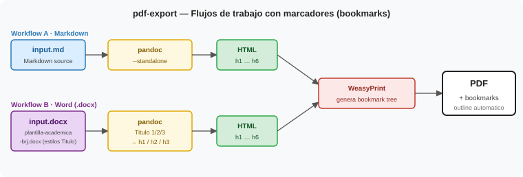

# pdf-export

Exporta documentos a **PDF con marcadores/bookmarks** a partir de dos fuentes posibles: Markdown (`.md`) o Word (`.docx`). El pipeline compartido es Pandoc → HTML → WeasyPrint, que genera automáticamente el árbol de bookmarks a partir de los headings H1–H6.



---

## Workflow A — Markdown → PDF con bookmarks

**Cuándo usarlo:** el contenido de partida es un fichero `.md` y se necesitan marcadores navegables en el PDF (sidebar de Acrobat/Evince).

### Requisitos

| Herramienta | Verificar |
|---|---|
| Pandoc ≥ 3.x | `pandoc --version` |
| WeasyPrint | `weasyprint --version` |

### Pasos

```powershell
# 1. Markdown → HTML (sin --katex; WeasyPrint no interpreta KaTeX)
pandoc input.md `
  --standalone `
  [-M title="<titulo>" -M author="<autor>" -M date="<fecha>"] `
  [--css=estilo.css] `
  -o output.html

# 2. HTML → PDF con bookmarks automaticos
weasyprint output.html output.pdf

# 3. Eliminar HTML intermedio
Remove-Item output.html

# 4. Abrir para revisar
& "C:\Program Files\Google\Chrome\Application\chrome.exe" output.pdf
```

### Notas

- Si el `.md` tiene frontmatter YAML (`title`, `author`, `date`), Pandoc los aplica directamente con `--standalone`; no hace falta `-M`.
- Los headings `#`, `##`, `###` del Markdown se convierten en `<h1>`, `<h2>`, `<h3>` — WeasyPrint los registra como niveles 1, 2, 3 del outline PDF.
- **Formulas LaTeX:** WeasyPrint no renderiza KaTeX. Si el documento tiene formulas matematicas complejas, usar Pipeline A (Chrome headless) en su lugar — sin bookmarks pero con formulas correctas. Ver [`SKILL.md`](SKILL.md).

---

## Workflow B — Word (.docx) → PDF con bookmarks

**Cuándo usarlo:** el contenido de partida es un `.docx` creado con la plantilla `plantilla-academica-brj.docx`, que usa estilos de Word `Titulo 1`, `Titulo 2`, `Titulo 3`. Pandoc mapea esos estilos a `<h1>`, `<h2>`, `<h3>` en HTML, y WeasyPrint los convierte en bookmarks PDF.

### Requisitos

| Herramienta | Verificar |
|---|---|
| Pandoc ≥ 3.x | `pandoc --version` |
| WeasyPrint | `weasyprint --version` |
| `.docx` con estilos de heading | Estilos `Titulo 1/2/3` aplicados en Word |

> La plantilla de referencia se encuentra en `template/plantilla-academica-brj.docx`.
> El fichero de entrada debe haber sido redactado usando esa plantilla (o tener los mismos estilos de titulo). Sin estilos de heading en el DOCX, Pandoc no puede generar un arbol de headings y el PDF saldra sin bookmarks.

### Pasos

```powershell
# 1. DOCX → HTML (Pandoc mapea Heading N / Titulo N → h1/h2/h3 automaticamente)
pandoc input.docx `
  --standalone `
  [--css=estilo.css] `
  -o output.html

# 2. Verificar que los headings se mapearon correctamente
Select-String -Path output.html -Pattern "<h[1-6]"

# 3. HTML → PDF con bookmarks automaticos
weasyprint output.html output.pdf

# 4. Eliminar HTML intermedio
Remove-Item output.html

# 5. Abrir para revisar
& "C:\Program Files\Google\Chrome\Application\chrome.exe" output.pdf
```

Si el Paso 2 no devuelve resultados, el DOCX no tiene estilos de heading aplicados — revisar en Word que los titulos usan `Titulo 1`, `Titulo 2`, etc. y no formato manual (negrita + tamaño grande).

### Notas

- Pandoc traduce automaticamente los estilos estandar de Word (`Heading 1`/`Titulo 1` segun el idioma del documento) sin flags adicionales.
- El contenido del cuerpo (parrafos normales, tablas, listas) se convierte correctamente.
- Las imagenes embebidas en el DOCX se extraen como base64 al HTML y aparecen en el PDF.
- Si el DOCX usa estilos personalizados que no son `Heading N` o `Titulo N`, Pandoc los ignorara como headings.

---

## Múltiples archivos MD → un solo PDF

Cuando el contenido está repartido en varios `.md` (capítulos, módulos, secciones), úsalos con `concat_md.py` antes de pasar al pipeline:

```powershell
# Une todos los capítulos en un solo .md, extrae el frontmatter del primero
python concat_md.py capitulos\cap*.md -o combined.md

# Con metadatos explícitos
python concat_md.py capitulos\cap*.md -o combined.md `
    --title "Mi Libro" --author "Bernardo Ronquillo" --date "2026"

# Insertar saltos de página explícitos entre secciones (útil con Chrome/Pipeline A)
python concat_md.py capitulos\cap*.md -o combined.md --pagebreaks

# Concatenar desde un directorio completo
python concat_md.py --dir capitulos\ -o combined.md
```

El `combined.md` resultante se pasa directamente al paso 1 de Workflow A (Pandoc).

### Opciones de `concat_md.py`

| Opción | Descripción |
|---|---|
| `files` | Archivos .md o patrones glob (`cap*.md`) |
| `--dir DIR` | Directorio completo; ordena por nombre |
| `-o SALIDA` | Archivo .md de salida (requerido) |
| `--title`, `--author`, `--date` | Metadatos para el frontmatter YAML |
| `--lang` | Código ISO de idioma (default: `es`) |
| `--pagebreaks` | Insertar `<div page-break>` entre secciones |
| `--keep-frontmatter` | No eliminar el frontmatter YAML de los fuentes |

> **Nota sobre page breaks:** con el CSS del pipeline (`break-before: page` en `h1`), los saltos de página ya se aplican automáticamente en cada capítulo — `--pagebreaks` solo es necesario si el CSS no está configurado o si se quiere un salto en una sección que no empieza con `#`.

### Fallback para bookmarks: PyMuPDF

Si WeasyPrint no está disponible (Windows sin GTK), el script `example/make_pdf.py` usa Chrome headless + PyMuPDF para inyectar los bookmarks post-generación. Búsqueda secuencial de headings — funciona correctamente incluso con títulos de sección repetidos entre capítulos.

---

## Comparativa

| | Workflow A (MD) | Workflow B (DOCX) |
|---|---|---|
| Fuente | `.md` | `.docx` con plantilla |
| Formulas LaTeX | No (usar Chrome headless) | No |
| Bookmarks automaticos | Si (de `#`, `##`, `###`) | Si (de estilos `Titulo N`) |
| CSS personalizado | Si (`--css=estilo.css`) | Si (`--css=estilo.css`) |
| Metadatos | Frontmatter YAML o flags `-M` | Extraidos del DOCX |

---

## Plantilla Word

La plantilla `template/plantilla-academica-brj.docx` define:

- Estilos de titulo: `Titulo 1`, `Titulo 2`, `Titulo 3` → mapeados a `h1`, `h2`, `h3`
- Fuentes, margenes y espaciado del documento academico estandar BRJ

Para usar la plantilla en un documento nuevo en Word: **Archivo → Nuevo → Nuevo desde plantilla existente** y seleccionar `plantilla-academica-brj.docx`.

---

Referencia completa del protocolo de ejecucion, verificacion de setup y manejo de errores: [`SKILL.md`](SKILL.md)
